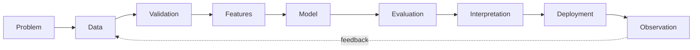

<!-- =========================================================
     NIKITA GAJBHIYE — GITHUB PROFILE
     Data Science • Machine Learning • Data Engineering
========================================================== -->

<div align="center">

# Nikita Gajbhiye

### Data Science · Machine Learning · Data Engineering

**Building reliable data systems, interpretable machine learning models, and responsible AI systems.**

<br>

[](https://www.linkedin.com/in/nikita-gajbhiye-101782264)
[](mailto:nikitagajbhiye.ng@gmail.com)
[](https://github.com/Nikita3005)

</div>

---

## Profile

I work at the intersection of **data science, machine learning, and data engineering**, with an interest in building systems that are not only predictive, but also **reliable, interpretable, reproducible, and useful in practice**.

My projects span the complete data lifecycle — from ingestion and validation to feature engineering, modeling, evaluation, explainability, and deployment.

More recently, I have been exploring **AI-agent security and data provenance**, particularly how untrusted information propagates through autonomous systems and how runtime policies can make those systems safer.

```text
Data  →  Representation  →  Models  →  Evaluation  →  Systems  →  Decisions
          ↑                   ↑            ↑             ↑
       Quality            Learning    Explainability  Reliability
```

---

## Selected Work

<table>
<tr>
<td width="50%" valign="top">

### TaintGate

**Provenance-aware runtime security for AI agents**

Explores how untrusted information can be tracked through agent workflows and incorporated into deterministic security decisions.

`Python` `AI Agents` `MCP` `Provenance` `Policy`

**Core idea**

`untrusted input → provenance → policy → ALLOW / REVIEW / BLOCK`

[Explore TaintGate →](https://github.com/Nikita3005/taintgate)

</td>
<td width="50%" valign="top">

### Enterprise Customer Intelligence

**End-to-end machine learning system**

A production-oriented ML project covering feature engineering, model comparison, explainability, experiment tracking, serving, and testing.

`Python` `XGBoost` `LightGBM` `SHAP` `MLflow` `FastAPI`

**Focus**

`features → models → evaluation → explanation → serving`

[Explore the platform →](https://github.com/Nikita3005/enterprise-customer-intelligence-platform)

</td>
</tr>

<tr>
<td width="50%" valign="top">

### Supply Chain Risk Intelligence

**Applied data science for operational risk**

Transforms supply-chain and operational data into structured signals for risk analysis and decision support.

`Data Science` `Feature Engineering` `Risk Analytics`

**Focus**

`operational data → risk signals → decision intelligence`

[Explore the project →](https://github.com/Nikita3005/Global-Supply-Chain-Risk-Intelligence-Platform)

</td>
<td width="50%" valign="top">

### HealthLynked Provider Pipeline

**Reliable healthcare data processing**

A data-engineering pipeline centered on ingestion, validation, transformation, and data-quality workflows for provider data.

`Python` `ETL` `Validation` `Data Quality`

**Focus**

`ingestion → validation → transformation → trusted data`

[Explore the pipeline →](https://github.com/Nikita3005/HealthLynked-Provider-Pipeline)

</td>
</tr>

<tr>
<td width="50%" valign="top">

### Fraud Detection & Risk Modeling

**Machine learning for predictive risk**

Investigates patterns associated with fraudulent behavior and develops predictive models for risk estimation.

`Classification` `Feature Engineering` `Model Evaluation`

[Explore the project →](https://github.com/Nikita3005/Fraud-Detection-Risk-Modeling)

</td>
<td width="50%" valign="top">

### Customer Churn Analytics

**Behavioral modeling and customer analytics**

Examines customer behavior, develops predictive features, and models factors associated with customer churn.

`EDA` `Classification` `Feature Engineering` `Analytics`

[Explore the project →](https://github.com/Nikita3005/Customer-Churn-Analytics)

</td>
</tr>
</table>

---

## Research & Technical Interests

<table>
<tr>
<td width="33%" valign="top">

### Statistical Learning

Model evaluation, generalization, predictive modeling, feature design, and the assumptions underlying data-driven methods.

</td>
<td width="33%" valign="top">

### Data-Centric ML

Data quality, representation, provenance, validation, and how upstream decisions affect downstream model behavior.

</td>
<td width="33%" valign="top">

### Responsible AI

Interpretability, reliability, provenance, runtime safeguards, and the behavior of ML and AI systems after deployment.

</td>
</tr>
</table>

Additional areas I am actively exploring:

`ML Systems` · `Explainable AI` · `Data Engineering` · `AI Agents` · `Model Reliability` · `Decision Intelligence`

---

## Technical Foundation

<table>
<tr>
<td width="22%"><b>Programming</b></td>
<td>Python · SQL</td>
</tr>
<tr>
<td><b>Data</b></td>
<td>Pandas · NumPy · ETL · Data Validation · Feature Engineering</td>
</tr>
<tr>
<td><b>Machine Learning</b></td>
<td>Scikit-learn · XGBoost · LightGBM · Model Evaluation</td>
</tr>
<tr>
<td><b>Interpretability</b></td>
<td>SHAP · Feature Analysis · Model Explanation</td>
</tr>
<tr>
<td><b>ML Engineering</b></td>
<td>FastAPI · MLflow · Docker · REST APIs · Model Serving</td>
</tr>
<tr>
<td><b>Analytics</b></td>
<td>Power BI · Excel · Exploratory Data Analysis · Visualization</td>
</tr>
</table>

<br>

<p align="center">

</p>

---

## How I Approach Data Science



I am particularly interested in the questions hidden between **data and decisions**:

* What assumptions are encoded in the data?
* How does data quality influence model behavior?
* Does a model generalize beyond the training distribution?
* Which signals drive its predictions?
* How should uncertainty and errors be interpreted?
* What changes once a model becomes part of a larger system?

For me, a successful data science project is not simply one with a high evaluation score. It should be **methodologically sound, reproducible, interpretable, and connected to the problem it is intended to solve**.

---

## Current Direction

My work is increasingly converging around three themes:

**01 — Data as infrastructure**
Building reliable pipelines and treating data quality as part of system design rather than a preprocessing afterthought.

**02 — Machine learning as a system**
Thinking beyond model training toward evaluation, explainability, reproducibility, APIs, deployment, and monitoring.

**03 — Reliability in emerging AI systems**
Exploring provenance and deterministic runtime controls for AI agents operating on potentially untrusted information.

These areas motivate my broader interest in advanced study across **data science, machine learning, statistical methods, and reliable AI systems**.

---

## Project Progression

```text
Analytics & BI
      │
      ▼
Applied Data Science
      │
      ▼
Machine Learning
      │
      ├──────────────► Data Engineering
      │
      ▼
Production ML Systems
      │
      ▼
Responsible & Secure AI
```

My repositories reflect this progression: from analytics and programming foundations toward increasingly complete systems involving **data pipelines, predictive modeling, explainability, model serving, and AI-system reliability**.

---

## GitHub Activity

<p align="center">
  
</p>

---

## Principles

> **Good data science begins before the model and continues after deployment.**

I value:

**rigorous analysis** · **reproducible workflows** · **clear assumptions** · **interpretable results** · **reliable systems**

---

<div align="center">

### Nikita Gajbhiye

Data Science · Machine Learning · Data Engineering · Responsible AI

*Interested in building data-driven systems that are rigorous, interpretable, and reliable.*

<br>

[LinkedIn](https://www.linkedin.com/in/nikita-gajbhiye-101782264) ·
[Email](mailto:nikitagajbhiye.ng@gmail.com) ·
[GitHub](https://github.com/Nikita3005)

</div>
