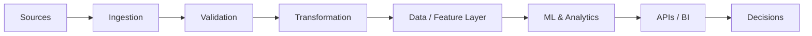

<h1 align="center">Nikita Gajbhiye</h1>

<h3 align="center">Data Engineer • ML Engineer • AI Systems Builder</h3>

<p align="center">
Building reliable data pipelines, production ML systems, analytics platforms, and safer AI agents.
</p>

<p align="center">
<a href="mailto:nikitagajbhiye.ng@gmail.com">

</a>
<a href="https://www.linkedin.com/in/nikita-gajbhiye-101782264">

</a>
<a href="https://github.com/Nikita3005">

</a>
</p>

---

## 👋 About Me

I'm a data and ML engineer focused on building systems that move beyond notebooks and dashboards into **reliable pipelines, production ML services, analytics platforms, and AI infrastructure**.

I enjoy working across the full lifecycle:

```text
Raw Data → Validation → Transformation → Modeling → APIs → Intelligence → Decisions
```

My current work sits at the intersection of **data engineering, machine learning, analytics, and AI-agent security**.

* 🔧 Building production-oriented **data and ML systems**
* 🧠 Working with **machine learning, feature engineering, and explainability**
* 🛡️ Exploring **runtime security and provenance for AI agents**
* 📊 Turning complex data into **decision-ready analytics**
* ⚙️ Interested in **automation, APIs, observability, and reliable system design**

---

## 🚀 Featured Engineering Projects

<table>
<tr>
<td width="50%" valign="top">

### 🛡️ TaintGate

**Runtime security for AI agents**

Provenance-aware security layer designed to track untrusted data as it moves through agent workflows and enforce deterministic security decisions.

**Highlights**

* Provenance-aware data flow
* Runtime policy enforcement
* `ALLOW / REVIEW / BLOCK` decisions
* AI-agent/tool security
* Prompt-injection defense concepts

**Focus:** AI Security • Agent Systems • Python

<a href="https://github.com/Nikita3005/taintgate"><b>View Repository →</b></a>

</td>

<td width="50%" valign="top">

### 🧠 Enterprise Customer Intelligence Platform

**Production-oriented machine learning platform**

End-to-end customer intelligence system covering feature engineering, model development, explainability, serving, and reproducible ML workflows.

**Highlights**

* ML model serving
* FastAPI endpoints
* MLflow experiment tracking
* SHAP explainability
* Automated testing
* Containerized workflows

**Focus:** ML Engineering • MLOps • APIs

<a href="https://github.com/Nikita3005/enterprise-customer-intelligence-platform"><b>View Repository →</b></a>

</td>
</tr>

<tr>
<td width="50%" valign="top">

### 🌍 Global Supply Chain Risk Intelligence Platform

**Data + ML system for supply-chain intelligence**

Designed to transform operational data into structured risk signals and decision-ready intelligence.

**Highlights**

* Data ingestion and transformation
* Risk-oriented analytics
* Feature engineering
* Intelligence workflows
* Business-facing outputs

**Focus:** Data Engineering • ML • Risk Analytics

<a href="https://github.com/Nikita3005/Global-Supply-Chain-Risk-Intelligence-Platform"><b>View Repository →</b></a>

</td>

<td width="50%" valign="top">

### 🏥 HealthLynked Provider Pipeline

**Provider data engineering pipeline**

Pipeline-oriented project focused on ingesting, validating, transforming, and preparing healthcare provider data for downstream use.

**Highlights**

* Data ingestion
* Validation
* Transformation
* Data quality
* Pipeline-oriented architecture

**Focus:** Data Engineering • ETL • Data Quality

<a href="https://github.com/Nikita3005/HealthLynked-Provider-Pipeline"><b>View Repository →</b></a>

</td>
</tr>

<tr>
<td width="50%" valign="top">

### 💳 Fraud Detection & Risk Modeling

**Machine-learning risk system**

Applied ML project focused on identifying suspicious behavior and converting transaction data into useful risk signals.

**Highlights**

* Feature engineering
* Classification workflows
* Risk modeling
* Model evaluation
* Analytical interpretation

**Focus:** Machine Learning • Risk • Analytics

<a href="https://github.com/Nikita3005/Fraud-Detection-Risk-Modeling"><b>View Repository →</b></a>

</td>

<td width="50%" valign="top">

### 📈 Customer Churn Analytics

**Customer retention intelligence**

Analytics and machine-learning workflow for understanding customer behavior and identifying churn risk.

**Highlights**

* Customer analytics
* Behavioral features
* Churn modeling
* Segmentation
* Business insights

**Focus:** ML • Analytics • Customer Intelligence

<a href="https://github.com/Nikita3005/Customer-Churn-Analytics"><b>View Repository →</b></a>

</td>
</tr>
</table>

---

## 🧰 Engineering Stack

### Languages & Data

<p>


</p>

### Machine Learning

<p>


</p>

### ML Systems & Backend

<p>


</p>

### Analytics & BI

<p>


</p>

---

## 🏗️ How I Think About Systems



A useful system isn't finished when the model trains or the dashboard renders.

I care about the complete path from **raw information to reliable decisions** — including data quality, reproducibility, serving, explainability, and security.

---

## 🔬 Current Engineering Interests

<table>
<tr>
<td width="50%" valign="top">

### Building

* Data pipelines
* Production ML services
* Analytics platforms
* AI-agent security tooling
* Automated data workflows

</td>
<td width="50%" valign="top">

### Deepening

* Cloud data engineering
* MLOps
* AI agent architectures
* Data modeling
* Runtime AI security

</td>
</tr>
</table>

---

## 📊 GitHub Activity

<p align="center">


</p>

<p align="center">

</p>

---

## ⚡ Engineering Philosophy

> **Build systems, not just notebooks.**

Good engineering turns raw data into something **reliable, reproducible, explainable, and useful**.

My goal is to build systems where data can move safely from ingestion to transformation, intelligence, and ultimately a decision.

---

<p align="center">
<b>Data Engineering × Machine Learning × AI Systems</b>
</p>

<p align="center">
<i>Building reliable data systems, production ML, and safer AI agents.</i>
</p>

<p align="center">
<a href="mailto:nikitagajbhiye.ng@gmail.com">Email</a>
&nbsp;•&nbsp;
<a href="https://www.linkedin.com/in/nikita-gajbhiye-101782264">LinkedIn</a>
&nbsp;•&nbsp;
<a href="https://github.com/Nikita3005">GitHub</a>
</p>

<p align="center">

</p>
