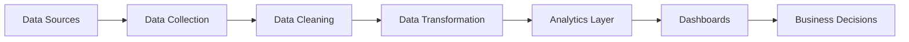

<h1 align="center">Hi 👋, I'm Nikita Gajbhiye</h1>

<h3 align="center">Data Engineer • Analytics Engineer • ML Practitioner</h3>

---

# 🚀 About Me

<table>
<tr>
<td width="50%">

### 🎯 Focus Areas

* Data Engineering
* Analytics Engineering
* Business Intelligence
* Machine Learning Workflows
* Reporting Automation

</td>

<td width="50%">

### ⚡ What I Build

* ETL Pipelines
* Analytics Platforms
* KPI Dashboards
* Data Products
* Automated Reporting Systems

</td>
</tr>
</table>

---

# 🛠 Tech Arsenal

---

# 🏗 Architecture Blueprint

---

# 📂 Featured Projects

<table>
<tr>

<td width="50%">

### 📊 Sales Intelligence Dashboard

Power BI dashboard for:

* Revenue Analysis
* KPI Monitoring
* Regional Insights
* Executive Reporting

**Stack**

Power BI • SQL • Excel

</td>

<td width="50%">

### 👥 Customer Analytics Platform

Customer analytics solution for:

* Segmentation
* Behavioral Analysis
* Churn Detection
* Insight Generation

**Stack**

Python • SQL • Analytics

</td>

</tr>

<tr>

<td width="50%">

### 🏢 HR Analytics Dashboard

Workforce analytics platform:

* Attrition Analysis
* Department Metrics
* Workforce Insights
* HR Reporting

**Stack**

Power BI • Excel • SQL

</td>

<td width="50%">

### ⚙️ Data Quality Automation

Automated preprocessing system:

* Validation
* Cleaning
* Standardization
* Reporting

**Stack**

Python • Pandas

</td>

</tr>
</table>

---

# 📈 Current Focus

<table>
<tr>

<td width="50%">

### 🔨 Building

* Data Pipelines
* Analytics Dashboards
* Reporting Automation
* BI Solutions

</td>

<td width="50%">

### 📚 Learning

* Cloud Data Engineering
* Advanced SQL
* Data Modeling
* Analytics Engineering

</td>

</tr>
</table>

---

# 📊 GitHub Intelligence Report

---

# 🎯 Engineering Philosophy

<table>
<tr>
<td>

### Data → Insights → Decisions

I believe successful analytics starts with clean and reliable data.

My focus is building systems that help organizations move from information overload to actionable insights.

</td>
</tr>
</table>

---

# 🌐 Connect With Me

---

# 💡 Final System Message

> Building scalable data systems, analytics platforms, and business intelligence solutions that transform complex information into measurable business value.

