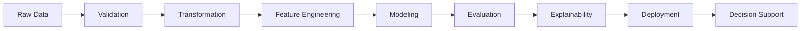

<h1 align="center">Nikita Gajbhiye</h1>

<h3 align="center">Data Science • Machine Learning • Data Engineering</h3>

<p align="center">
Building reliable, interpretable, and data-driven systems across machine learning, data engineering, analytics, and responsible AI.
</p>

<p align="center">
  <a href="mailto:nikitagajbhiye.ng@gmail.com">
    
  </a>
  <a href="https://www.linkedin.com/in/nikita-gajbhiye-101782264">
    
  </a>
  <a href="https://github.com/Nikita3005">
    
  </a>
</p>

---

## About Me

I am interested in applying **data science, statistical learning, and computational methods** to complex real-world problems.

My work spans the full data lifecycle:

**Data Collection → Validation → Transformation → Feature Engineering → Modeling → Evaluation → Deployment → Decision Support**

I enjoy building systems that combine strong analytical foundations with practical engineering.

My current interests include:

* Machine Learning & Statistical Modeling
* Data Engineering & Data Quality
* Applied Data Science
* Explainable & Responsible AI
* ML Systems & Model Deployment
* AI Agents, Provenance & Runtime Security

---

## Selected Projects

### 🛡️ TaintGate

**Provenance-Aware Runtime Security for AI Agents**

A security-focused system exploring how untrusted information propagates through AI-agent workflows and how provenance-aware policies can enforce deterministic runtime decisions.

**Key Areas**

`AI Agents` • `Provenance Tracking` • `Policy Enforcement` • `Runtime Security` • `MCP`

**Decision Model**

`ALLOW → REVIEW → BLOCK`

[View Repository](https://github.com/Nikita3005/taintgate)

---

### 🧠 Enterprise Customer Intelligence Platform

An end-to-end machine learning platform designed around the complete ML lifecycle rather than model training alone.

**Key Areas**

* Feature Engineering
* Supervised Machine Learning
* XGBoost & LightGBM
* SHAP Explainability
* MLflow Experiment Tracking
* FastAPI Model Serving
* Automated Testing
* Containerized Workflows

**Focus**

`Machine Learning` • `Explainable AI` • `MLOps` • `Model Serving`

[View Repository](https://github.com/Nikita3005/enterprise-customer-intelligence-platform)

---

### 🌍 Global Supply Chain Risk Intelligence Platform

Applied data science project focused on transforming operational and supply-chain data into structured risk signals and decision-ready intelligence.

**Focus**

`Data Processing` • `Feature Engineering` • `Risk Analytics` • `Decision Intelligence`

[View Repository](https://github.com/Nikita3005/Global-Supply-Chain-Risk-Intelligence-Platform)

---

### 🏥 HealthLynked Provider Pipeline

A data engineering project focused on building a reliable processing pipeline for healthcare provider data.

**Key Areas**

* Data Ingestion
* Validation
* Cleaning
* Transformation
* Data Quality
* Reproducible Processing

**Focus**

`Data Engineering` • `ETL` • `Healthcare Data` • `Data Quality`

[View Repository](https://github.com/Nikita3005/HealthLynked-Provider-Pipeline)

---

### 💳 Fraud Detection & Risk Modeling

Applied machine learning project focused on identifying suspicious patterns and translating transactional data into predictive risk signals.

**Focus**

`Classification` • `Feature Engineering` • `Model Evaluation` • `Risk Modeling`

[View Repository](https://github.com/Nikita3005/Fraud-Detection-Risk-Modeling)

---

### 📈 Customer Churn Analytics

Machine learning and analytics project exploring customer behavior and factors associated with churn.

**Focus**

`Exploratory Data Analysis` • `Feature Engineering` • `Classification` • `Customer Analytics`

[View Repository](https://github.com/Nikita3005/Customer-Churn-Analytics)

---

## Technical Toolkit

### Programming & Data

<p>
  
  
  
  
</p>

### Machine Learning

<p>
  
  
  
  
</p>

### ML Systems & Engineering

<p>
  
  
  
  
</p>

### Analytics

<p>
  
  
</p>

---

## From Data to Decisions



I am particularly interested in what happens **between a dataset and a decision**:

* How does data quality affect downstream models?
* How do features encode assumptions?
* How reliably does a model generalize?
* How should predictions be interpreted?
* How should ML systems behave after deployment?

---

## Research & Academic Interests

### Machine Learning & Statistical Learning

Understanding how predictive models generalize, how they should be evaluated, and how statistical reasoning can improve machine learning systems.

### Data-Centric AI

Studying how data quality, representation, provenance, labeling, and feature construction influence downstream model behavior.

### Explainable & Responsible AI

Exploring methods for building machine learning systems that are interpretable, reliable, and aligned with their intended use.

### Reliable ML Systems

Understanding the complete lifecycle of machine learning systems, including experimentation, deployment, monitoring, reproducibility, and evaluation.

### AI Agent Security

Exploring provenance, policy enforcement, and runtime safeguards for increasingly autonomous AI systems.

---

## Engineering Approach

```text
Understand the Problem
        ↓
Inspect the Data
        ↓
Question Assumptions
        ↓
Build Reproducible Pipelines
        ↓
Model & Evaluate
        ↓
Interpret Results
        ↓
Deploy When Appropriate
        ↓
Measure Real-World Behavior
```

I view data science as more than optimizing a model metric.

A useful system should be **methodologically sound, reproducible, interpretable, and connected to the problem it is intended to solve**.

---

## GitHub Activity

<p align="center">
  
</p>

<p align="center">
  
</p>

---

## Continuous Growth

I use GitHub as a record of my progression from **programming and analytics fundamentals** toward increasingly complete work in **data science, machine learning, data engineering, and AI systems**.

My goal is not simply to build more projects, but to continuously improve how I:

* formulate problems,
* work with data,
* evaluate evidence,
* design experiments,
* interpret models, and
* build reliable computational systems.

---

<p align="center">
  <b>Data Science • Machine Learning • Data Engineering • Responsible AI</b>
</p>

<p align="center">
  <i>Building data-driven systems that are useful, interpretable, reproducible, and reliable.</i>
</p>

<p align="center">
  <a href="mailto:nikitagajbhiye.ng@gmail.com">Email</a>
  &nbsp;•&nbsp;
  <a href="https://www.linkedin.com/in/nikita-gajbhiye-101782264">LinkedIn</a>
  &nbsp;•&nbsp;
  <a href="https://github.com/Nikita3005">GitHub</a>
</p>
