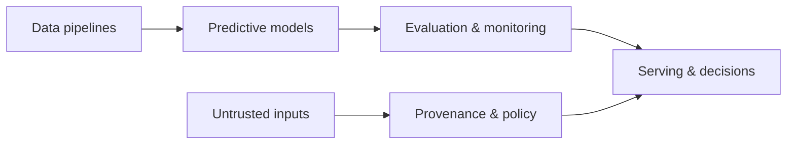

# Nikita Gajbhiye

**Data Science · Machine Learning · Data Engineering**

Four years of professional experience building data and ML systems

[Email](mailto:nikitagajbhiye.ng@gmail.com) · [LinkedIn](https://www.linkedin.com/in/nikita-gajbhiye-101782264)

## Systems view

My work connects data quality, predictive modeling, evaluation, and the boundaries where a system makes decisions.

```mermaid
flowchart LR
    A["Data pipelines"] --> B["Predictive models"]
    B --> C["Evaluation & monitoring"]
    C --> D["Serving & decisions"]
    U["Untrusted inputs"] --> G["Provenance & policy"]
    G --> D
```

DATA ENGINEERING &nbsp;→&nbsp; MACHINE LEARNING &nbsp;→&nbsp; RELIABILITY &nbsp;→&nbsp; RESPONSIBLE USE

## Selected projects

<table>
<tr>
<td align="center" valign="top" width="50%">

<h3><a href="https://github.com/Nikita3005/taintgate">TaintGate</a></h3>

<code>AI agent security</code> <code>Python</code> <code>MCP</code>

Checks protected agent tool calls before execution using input provenance, detectors, and deterministic policy.

<strong>ALLOW · REVIEW · BLOCK</strong>

<a href="https://github.com/Nikita3005/taintgate">Code and quickstart →</a>

</td>
<td align="center" valign="top" width="50%">

<h3><a href="https://github.com/Nikita3005/DriftForge">DriftForge</a></h3>

<code>Model reliability</code> <code>Benchmarking</code>

Studies whether drift signals warn of model degradation before aggregate accuracy falls.

<strong>495 controlled conditions</strong> with warning lead time and cross-dataset evaluation

<a href="https://github.com/Nikita3005/DriftForge">Code →</a> · <a href="https://github.com/Nikita3005/DriftForge/blob/main/TECHNICAL_REPORT.md">Technical report →</a>

</td>
</tr>
<tr>
<td align="center" valign="top" width="50%">

<h3><a href="https://github.com/Nikita3005/enterprise-customer-intelligence-platform">Customer Intelligence</a></h3>

<code>ML engineering</code> <code>Explainability</code>

Churn, customer lifetime value, and segmentation with SHAP, MLflow, FastAPI, automated tests, and CI.

<a href="https://github.com/Nikita3005/enterprise-customer-intelligence-platform">Explore platform →</a>

</td>
<td align="center" valign="top" width="50%">

<h3><a href="https://github.com/Nikita3005/Global-Supply-Chain-Risk-Intelligence-Platform">Supply Chain Risk</a></h3>

<code>Data engineering</code> <code>Risk analytics</code>

A Databricks Bronze–Silver–Gold workflow for delay prediction, vendor analysis, and SQL dashboards.

<a href="https://github.com/Nikita3005/Global-Supply-Chain-Risk-Intelligence-Platform">Explore platform →</a>

</td>
</tr>
</table>

## Additional work

| Project | Focus |
| :--- | :--- |
| [HealthLynked Provider Pipeline](https://github.com/Nikita3005/HealthLynked-Provider-Pipeline) | Provider data validation, duplicate detection, confidence scoring, and human review |
| [Fraud Detection & Risk Modeling](https://github.com/Nikita3005/Fraud-Detection-Risk-Modeling) | Imbalanced classification and precision–recall trade-offs |
| [Customer Churn Analytics](https://github.com/Nikita3005/Customer-Churn-Analytics) | Behavioral analysis, churn prediction, and Power BI reporting |

## Research direction

I am preparing for graduate study in data science. I am particularly interested in **distribution shift, reproducible evaluation, data-centric ML, and provenance-aware AI systems**. DriftForge and TaintGate are my current work on these questions; both repositories document their methods and limitations.

**Python · SQL · Pandas · PySpark · Scikit-learn · SHAP · MLflow · FastAPI · Databricks**

[Email](mailto:nikitagajbhiye.ng@gmail.com) · [LinkedIn](https://www.linkedin.com/in/nikita-gajbhiye-101782264)

