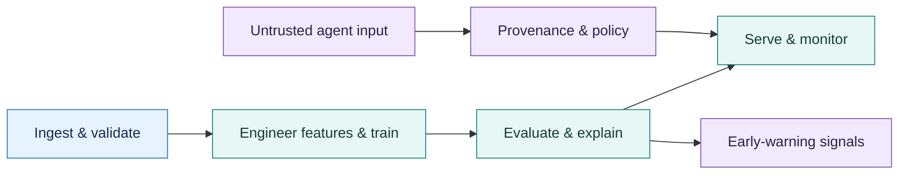

# Nikita Gajbhiye

### Data Science · Machine Learning · Data Engineering

**Four years of professional experience** building data and ML systems.  
Preparing for graduate study in data science, with a focus on reliable ML and trustworthy AI.

  
  
  

<table>
<tr>
<td align="center" width="25%">
  
</td>
<td align="center" width="25%">
  
</td>
<td align="center" width="25%">
  
</td>
<td align="center" width="25%">
  
</td>
</tr>
</table>

## How the work fits together

```mermaid
flowchart LR
    A["Ingest & validate"] --> B["Engineer features & train"]
    B --> C["Evaluate & explain"]
    C --> D["Serve & monitor"]
    U["Untrusted agent input"] --> G["Provenance & policy"]
    G --> D
    C --> W["Early-warning signals"]

    classDef data fill:#E7F2FF,stroke:#2874B8,color:#172B4D;
    classDef model fill:#E7F7F4,stroke:#13867D,color:#173B38;
    classDef safety fill:#F1EAFE,stroke:#7952B3,color:#302047;

    class A data;
    class B,C,D model;
    class U,G,W safety;
```

Data pipelines → predictive systems → evaluation → reliable decisions

## Featured projects

<table>
<tr>
<td valign="top" width="50%">

<h3>🛡️ <a href="https://github.com/Nikita3005/taintgate">TaintGate</a></h3>

A Python runtime guard that checks protected AI-agent tool calls <strong>before execution</strong>. It uses input provenance, detectors, and deterministic policy.

<code>untrusted input → provenance → policy → ALLOW / REVIEW / BLOCK</code>

<strong>Inspect:</strong> quickstart, framework and MCP integrations, and the local synthetic attack suite.

<a href="https://github.com/Nikita3005/taintgate">Explore the repository →</a>

</td>
<td valign="top" width="50%">

<h3>📉 <a href="https://github.com/Nikita3005/DriftForge">DriftForge</a></h3>

A research benchmark asking whether drift signals can warn of synthetic-data-induced degradation before aggregate model accuracy falls.

<strong>495 controlled conditions</strong> across three datasets, three contamination mechanisms, five seeds, and eleven levels.

<strong>Inspect:</strong> warning lead time, cross-dataset tests, ablations, and limitations of threshold transfer.

<a href="https://github.com/Nikita3005/DriftForge">Repository →</a> · <a href="https://github.com/Nikita3005/DriftForge/blob/main/TECHNICAL_REPORT.md">Technical report →</a>

</td>
</tr>
<tr>
<td valign="top" width="50%">

<h3>🧠 <a href="https://github.com/Nikita3005/enterprise-customer-intelligence-platform">Customer Intelligence</a></h3>

Churn prediction, customer lifetime value estimation, and segmentation in a modular ML project with SHAP, MLflow, FastAPI, automated tests, and CI.

<a href="https://github.com/Nikita3005/enterprise-customer-intelligence-platform">Explore the platform →</a>

</td>
<td valign="top" width="50%">

<h3>🌐 <a href="https://github.com/Nikita3005/Global-Supply-Chain-Risk-Intelligence-Platform">Supply Chain Risk</a></h3>

A Databricks Bronze–Silver–Gold workflow for shipment delay prediction, vendor risk analysis, experiment tracking, and SQL dashboards.

<a href="https://github.com/Nikita3005/Global-Supply-Chain-Risk-Intelligence-Platform">Explore the platform →</a>

</td>
</tr>
</table>

## Additional projects

| Project | Technical focus |
| :--- | :--- |
| **[HealthLynked Provider Pipeline](https://github.com/Nikita3005/HealthLynked-Provider-Pipeline)** | Record validation, duplicate matching, confidence scoring, audit trails, and human review |
| **[Fraud Detection & Risk Modeling](https://github.com/Nikita3005/Fraud-Detection-Risk-Modeling)** | Imbalanced classification, precision–recall evaluation, and decision thresholds |
| **[Customer Churn Analytics](https://github.com/Nikita3005/Customer-Churn-Analytics)** | Behavioral modeling, churn prediction, and Power BI reporting |

## Research direction

I’m interested in **distribution shift, early-warning model monitoring, reproducible evaluation, and provenance-aware agent systems**. My goal is to make model limitations and system decision boundaries measurable and visible.

**Python · SQL · Pandas · PySpark · Scikit-learn · XGBoost · SHAP · MLflow · FastAPI · Databricks**

